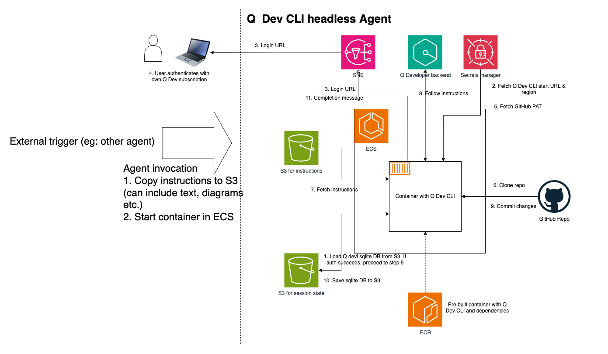

# Amazon Q Developer CLI Container

This project provides a Docker container that runs Amazon Q Developer CLI to automatically implement requirements from a document. It can be run locally or deployed to AWS Fargate for serverless execution.

## Overview

The container uses Amazon Q Developer CLI to:
1. Clone a repository
2. Read requirements from a specified document
3. Generate code implementations using Amazon Q
4. Commit and push changes to a new branch

## Architecture

The Amazon Q Developer CLI Container follows this architecture:



### Flow Overview

1. **Initialization**:
   - Instructions are copied to S3
   - Container is started in ECS

2. **Authentication Flow**:
   - Container loads the Q Developer CLI database from S3 (if it exists)
   - Container fetches Amazon Q credentials from Secrets Manager
   - Container requests authentication URL and code from Q Developer backend
   - Authentication URL and code are sent to the SNS topic
   - User receives email with authentication URL and code
   - User authenticates with their Amazon Q Developer Pro subscription
   - Authentication status is saved in the Q CLI database
   - Database is uploaded to S3 for persistence

3. **Processing Flow**:
   - Container fetches Git credentials from Secrets Manager
   - Container clones the target repository
   - Container fetches instructions from S3
   - Container processes requirements using Amazon Q Developer CLI
   - Container commits and pushes changes to the repository
   - Database is uploaded to S3 for persistence

## Project Structure

```
q-headless/
├── Dockerfile            # Container definition
├── README.md            # This documentation file
├── setup-fargate.sh     # Main script for Fargate setup
├── setup-iam-roles.sh   # Creates IAM roles for Fargate
├── setup-secrets.sh     # Sets up secrets in AWS Secrets Manager
├── setup-ecr.sh         # Sets up ECR and builds/pushes image
├── setup-ecs.sh         # Creates ECS cluster and task definition
├── run-fargate-task.sh  # Runs the task on Fargate
├── check-task-status.sh # Monitors task status and logs
└── scripts/             # Container scripts
    ├── expect-login.sh   # Automate Q CLI login prompts
    ├── q-authenticate.sh # Handle authentication
    ├── q-process-requirements.sh # Process requirements
    ├── sync-database.sh  # Sync Q CLI database with S3
    └── entrypoint.sh     # Container entrypoint
```

## Authentication Process

The container uses Amazon SNS to facilitate the authentication process:

1. **First Run**:
   - Container attempts to authenticate with Amazon Q Developer CLI
   - Authentication URL and code are sent to the SNS topic specified in `LOGIN_SNS_TOPIC`
   - Users subscribed to this SNS topic receive an email with the authentication URL and code
   - The user must visit the URL and authenticate with their Amazon Q Developer Pro subscription
   - After successful authentication, credentials are stored in the Q CLI database

2. **Subsequent Runs**:
   - Container checks if valid credentials exist in the database
   - If credentials are valid, it proceeds with processing requirements
   - If credentials have expired, the authentication process is repeated

Authentication only needs to be performed when the credentials in the database expire. The database is persisted between container runs using the S3 location specified in `Q_DATABASE_S3_URI`.

## Requirements Format

The container supports two ways to provide instructions:

1. **Single File**: Provide an S3 URI pointing directly to an `instructions.md` file:
   ```
   s3://your-bucket/path/to/instructions.md
   ```

2. **Directory with Multiple Files**: Provide an S3 prefix containing multiple files:
   ```
   s3://your-bucket/path/to/requirements/
   ```
   This directory should contain:
   - An `instructions.md` file with the main requirements
   - Optional supporting files such as wireframes, diagrams, or other reference materials

There is no specific structure required for the `instructions.md` file itself. You can format your requirements in any way that clearly communicates what needs to be implemented.

## Environment Variables

- `PROCESS_REQUIREMENTS`: Set to "true" to process requirements
- `REPO_URL`: URL of the Git repository to clone
- `INSTRUCTIONS_S3_URI`: S3 URI of the instructions file
- `BRANCH_NAME`: Git branch name for implementation (default: feature/q-implementation-timestamp)
- `COMMIT_MESSAGE`: Git commit message (default: "Implement requirements using Amazon Q Developer")
- `LOGIN_SNS_TOPIC`: SNS topic ARN for login notifications
- `Q_DATABASE_S3_URI`: S3 URI for storing/retrieving the Q CLI database
- `GIT_CREDENTIALS_SECRET_ID`: Secret ID for Git credentials (default: amazon-q-headless/git-credentials)
- `AMAZON_Q_CREDENTIALS_SECRET_ID`: Secret ID for Amazon Q credentials (default: amazon-q-headless/amazon-q-credentials)

## AWS Secrets Manager Setup

The container requires two secrets to be set up in AWS Secrets Manager:

1. **Git Credentials Secret** (default ID: `amazon-q-headless/git-credentials`):
   ```json
   {
     "token": "your-github-personal-access-token",
     "email": "your-email@example.com"
   }
   ```

2. **Amazon Q Credentials Secret** (default ID: `amazon-q-headless/amazon-q-credentials`):
   ```json
   {
     "sso_url": "https://d-xxxxxxxxxx.awsapps.com/start",
     "region": "us-east-1"
   }
   ```

You can create these secrets using the provided `setup-secrets.sh` script or manually through the AWS Management Console or AWS CLI.

## Running Locally with Docker

You can run the container locally for testing:

```bash
docker build -t amazon-q-dev-cli .

docker run -it --rm \
  -e PROCESS_REQUIREMENTS=true \
  -e REPO_URL=https://github.com/yourusername/your-repo.git \
  -e INSTRUCTIONS_S3_URI=s3://your-bucket/path/to/instructions.md \
  -e BRANCH_NAME=feature-branch \
  -e Q_DATABASE_S3_URI=s3://your-bucket/path/to/database/data.sqlite3 \
  -e GIT_CREDENTIALS_SECRET_ID=amazon-q-headless/git-credentials \
  -e AMAZON_Q_CREDENTIALS_SECRET_ID=amazon-q-headless/amazon-q-credentials \
  -v ~/.aws:/root/.aws:ro \
  amazon-q-dev-cli
```

## Running on AWS Fargate

### Prerequisites

- AWS CLI installed and configured with appropriate permissions
- Docker installed locally
- A VPC with at least one public subnet and security group that allows outbound traffic
- Git repository for code implementation

### Automated Setup

We've provided a set of scripts to automate the Fargate setup process:

```bash
./setup-fargate.sh
```

This script guides you through:
- Setting up IAM roles
- Setting up secrets in AWS Secrets Manager
- Building and pushing the Docker image
- Creating the ECS cluster and task definition
- Running the task on Fargate
- Completing authentication
- Running the task again to process requirements

### Manual Setup Steps

If you prefer to set up manually, follow these steps:

#### 1. Set up IAM Roles and Policies

```bash
# Create ECS Task Execution Role
aws iam create-role \
  --role-name ecsTaskExecutionRole \
  --assume-role-policy-document '{
    "Version": "2012-10-17",
    "Statement": [
      {
        "Effect": "Allow",
        "Principal": {
          "Service": "ecs-tasks.amazonaws.com"
        },
        "Action": "sts:AssumeRole"
      }
    ]
  }'

# Attach required policies
aws iam attach-role-policy \
  --role-name ecsTaskExecutionRole \
  --policy-arn arn:aws:iam::aws:policy/service-role/AmazonECSTaskExecutionRolePolicy
aws iam attach-role-policy \
  --role-name ecsTaskExecutionRole \
  --policy-arn arn:aws:iam::aws:policy/CloudWatchLogsFullAccess

# Create Amazon Q Task Role
aws iam create-role \
  --role-name AmazonQTaskRole \
  --assume-role-policy-document '{
    "Version": "2012-10-17",
    "Statement": [
      {
        "Effect": "Allow",
        "Principal": {
          "Service": "ecs-tasks.amazonaws.com"
        },
        "Action": "sts:AssumeRole"
      }
    ]
  }'

# Create and attach policy for Amazon Q Task Role
aws iam create-policy \
  --policy-name AmazonQTaskPolicy \
  --policy-document '{
    "Version": "2012-10-17",
    "Statement": [
      {
        "Effect": "Allow",
        "Action": [
          "s3:GetObject",
          "s3:PutObject",
          "s3:ListBucket"
        ],
        "Resource": [
          "arn:aws:s3:::*/*",
          "arn:aws:s3:::*"
        ]
      },
      {
        "Effect": "Allow",
        "Action": [
          "sns:Publish"
        ],
        "Resource": "*"
      },
      {
        "Effect": "Allow",
        "Action": [
          "secretsmanager:GetSecretValue"
        ],
        "Resource": [
          "arn:aws:secretsmanager:*:*:secret:amazon-q-headless/*"
        ]
      }
    ]
  }'

# Attach policy
POLICY_ARN=$(aws iam list-policies --query "Policies[?PolicyName=='AmazonQTaskPolicy'].Arn" --output text)
aws iam attach-role-policy \
  --role-name AmazonQTaskRole \
  --policy-arn $POLICY_ARN
```

#### 2. Build and Push the Docker Image

```bash
# Get AWS account ID
AWS_ACCOUNT_ID=$(aws sts get-caller-identity --query "Account" --output text)
AWS_REGION="us-east-1"

# Create ECR repository
aws ecr create-repository --repository-name amazon-q-dev-cli

# Build and push image
docker build -t amazon-q-dev-cli .
aws ecr get-login-password --region $AWS_REGION | docker login --username AWS --password-stdin $AWS_ACCOUNT_ID.dkr.ecr.$AWS_REGION.amazonaws.com
docker tag amazon-q-dev-cli:latest $AWS_ACCOUNT_ID.dkr.ecr.$AWS_REGION.amazonaws.com/amazon-q-dev-cli:latest
docker push $AWS_ACCOUNT_ID.dkr.ecr.$AWS_REGION.amazonaws.com/amazon-q-dev-cli:latest
```

#### 3. Set up AWS Secrets Manager

```bash
# Create Git credentials secret
aws secretsmanager create-secret \
  --name amazon-q-headless/git-credentials \
  --description "Git credentials for Amazon Q Headless" \
  --secret-string '{
    "token": "your-github-personal-access-token",
    "email": "your-email@example.com"
  }'

# Create Amazon Q credentials secret
aws secretsmanager create-secret \
  --name amazon-q-headless/amazon-q-credentials \
  --description "Amazon Q credentials for Amazon Q Headless" \
  --secret-string '{
    "sso_url": "https://view.awsapps.com/start",
    "region": "us-east-1"
  }'
```

#### 4. Set up S3 Bucket and SNS Topic

```bash
# Create S3 bucket and SNS topic
BUCKET_NAME="amazon-q-demo-$(date +%s)"
aws s3 mb s3://$BUCKET_NAME
SNS_TOPIC_ARN=$(aws sns create-topic --name q-dev-cli-login --query 'TopicArn' --output text)

# Subscribe your email to the SNS topic
aws sns subscribe \
  --topic-arn $SNS_TOPIC_ARN \
  --protocol email \
  --notification-endpoint your-email@example.com

# Create and upload sample instructions
cat > dummy_instructions.md << 'EOF'
## Feature Requirements
- Create a simple REST API endpoint that returns the current time
- Add a health check endpoint that returns system status
## End Requirements
EOF
aws s3 cp dummy_instructions.md s3://$BUCKET_NAME/q-headless/dummy_instructions.md
```

#### 5. Create ECS Cluster and Task Definition

```bash
# Create ECS cluster
aws ecs create-cluster --cluster-name amazon-q-cluster

# Create task definition
cat > amazon-q-task-cli.json << EOF
{
  "family": "amazon-q-task-cli",
  "executionRoleArn": "arn:aws:iam::$AWS_ACCOUNT_ID:role/ecsTaskExecutionRole",
  "taskRoleArn": "arn:aws:iam::$AWS_ACCOUNT_ID:role/AmazonQTaskRole",
  "networkMode": "awsvpc",
  "containerDefinitions": [
    {
      "name": "amazon-q-container",
      "image": "$AWS_ACCOUNT_ID.dkr.ecr.$AWS_REGION.amazonaws.com/amazon-q-dev-cli:latest",
      "essential": true,
      "environment": [
        { "name": "PROCESS_REQUIREMENTS", "value": "true" },
        { "name": "LOGIN_SNS_TOPIC", "value": "$SNS_TOPIC_ARN" },
        { "name": "REPO_URL", "value": "https://github.com/yourusername/your-repo.git" },
        { "name": "INSTRUCTIONS_S3_URI", "value": "s3://$BUCKET_NAME/q-headless/dummy_instructions.md" },
        { "name": "BRANCH_NAME", "value": "main" },
        { "name": "Q_DATABASE_S3_URI", "value": "s3://$BUCKET_NAME/q-headless/database/data.sqlite3" },
        { "name": "GIT_CREDENTIALS_SECRET_ID", "value": "amazon-q-headless/git-credentials" },
        { "name": "AMAZON_Q_CREDENTIALS_SECRET_ID", "value": "amazon-q-headless/amazon-q-credentials" }
      ],
      "logConfiguration": {
        "logDriver": "awslogs",
        "options": {
          "awslogs-group": "/ecs/amazon-q-task-cli",
          "awslogs-region": "$AWS_REGION",
          "awslogs-stream-prefix": "ecs",
          "awslogs-create-group": "true"
        }
      }
    }
  ],
  "requiresCompatibilities": ["FARGATE"],
  "cpu": "2048",
  "memory": "8192"
}
EOF

aws ecs register-task-definition --cli-input-json file://amazon-q-task-cli.json
```

#### 6. Run the Task and Complete Authentication

```bash
# Run the task
SUBNET_ID="your-subnet-id"
SECURITY_GROUP_ID="your-security-group-id"
TASK_ARN=$(aws ecs run-task \
  --cluster amazon-q-cluster \
  --task-definition amazon-q-task-cli \
  --launch-type FARGATE \
  --network-configuration "awsvpcConfiguration={subnets=[$SUBNET_ID],securityGroups=[$SECURITY_GROUP_ID],assignPublicIp=ENABLED}" \
  --query 'tasks[0].taskArn' \
  --output text)
TASK_ID=$(echo $TASK_ARN | awk -F'/' '{print $3}')

# Wait for task to start and check logs for authentication URL
aws ecs wait tasks-running --cluster amazon-q-cluster --tasks $TASK_ARN
aws logs get-log-events \
  --log-group-name /ecs/amazon-q-task-cli \
  --log-stream-name ecs/amazon-q-container/$TASK_ID \
  --output text

# After completing authentication via the URL and code in the email, run the task again
aws ecs run-task \
  --cluster amazon-q-cluster \
  --task-definition amazon-q-task-cli \
  --launch-type FARGATE \
  --network-configuration "awsvpcConfiguration={subnets=[$SUBNET_ID],securityGroups=[$SECURITY_GROUP_ID],assignPublicIp=ENABLED}"
```

## Troubleshooting

### Authentication Issues
- Check that you've subscribed to the SNS topic with your email
- Verify you received the authentication email with URL and code
- Ensure you completed authentication with your Amazon Q Developer Pro subscription
- Check the task logs for any error messages
- Verify that the Amazon Q credentials secret contains the correct SSO URL and region

### Task Failures
- Check the CloudWatch logs for error messages
- Verify that the IAM roles have the necessary permissions
- Ensure the S3 bucket and objects are accessible

### Network Issues
- Verify that the subnet has a route to an Internet Gateway
- Check that the security group allows outbound traffic
- Ensure that public IP assignment is enabled for the task
